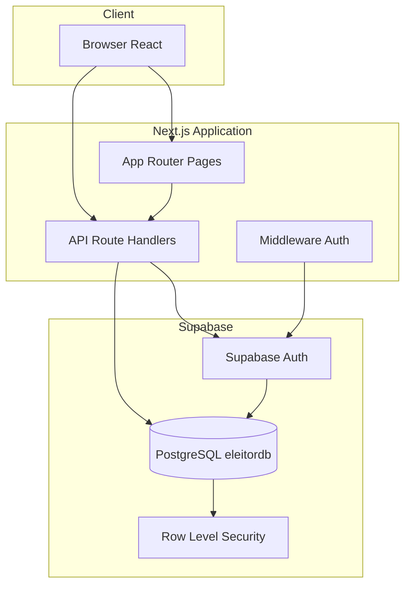

# Arquitetura — Sistema de Gestão de Eleitores

## Visão geral

Sistema administrativo multiusuário para cadastro, consulta e gestão de eleitores com controle territorial (estado → cidade → bairro → zona eleitoral), RBAC, auditoria completa e dashboard analítico.

## Stack

| Camada | Tecnologia |
|--------|------------|
| Frontend | Next.js 16 (App Router), React 19, Tailwind CSS 4 |
| Backend/API | Next.js Route Handlers (REST) |
| Banco | PostgreSQL (Supabase) |
| Auth | Supabase Auth (JWT + cookies SSR) |
| Segurança | RLS, bcrypt (Auth), Zod validation |
| Deploy | Docker + VPS Linux / Vercel |

## Diagrama de arquitetura



## Módulos

1. **Autenticação** — Login, logout, bloqueio por tentativas, sessões, último acesso
2. **RBAC** — Perfis (admin, coordenador, cadastrador, visualizador) + permissões granulares
3. **Eleitores** — CRUD com soft delete e classificação
4. **Territorial** — Estados, cidades, bairros, zonas
5. **Dashboard** — KPIs e gráficos (Recharts)
6. **Relatórios** — PDF/Excel/CSV (jspdf, xlsx)
7. **Auditoria** — Triggers automáticos + tabela `auditoria`

## Fluxo de permissões (RBAC)

```
Request → Middleware (JWT cookie)
       → API Route → requireSession()
       → Verifica permission slug
       → Supabase query (RLS dupla camada)
```

| Perfil | Permissões principais |
|--------|----------------------|
| admin_geral | Todas |
| coordenador | Visualizar/editar todos, aprovar, exportar, relatórios |
| cadastrador | Criar, editar próprios, visualizar permitidos |
| visualizador | Somente leitura |

Novos perfis: inserir em `perfis` + `perfil_permissoes` sem alterar código.

## Escalabilidade

- Índices em CPF, bairro, zona, situação, created_at
- Paginação na API (`page`, `limit`)
- RLS evita vazamento entre perfis
- Soft delete em eleitores
- View materializada pode ser adicionada para dashboard em alto volume

## LGPD

- Soft delete (direito ao esquecimento via exclusão lógica)
- Auditoria de acesso e alterações
- Consentimento e finalidade documentados em política externa
- Criptografia em trânsito (HTTPS) e senhas via Supabase Auth

## Estrutura de pastas

```
sistema-eleitores/
├── docs/                 # Documentação
├── supabase/
│   ├── migrations/       # Schema SQL
│   └── seed.sql          # Dados iniciais
├── src/
│   ├── app/
│   │   ├── (dashboard)/  # Área autenticada
│   │   ├── api/          # REST API
│   │   └── login/
│   ├── components/
│   ├── lib/
│   │   ├── auth/
│   │   ├── supabase/
│   │   └── validators/
│   └── types/
├── Dockerfile
└── docker-compose.yml
```
